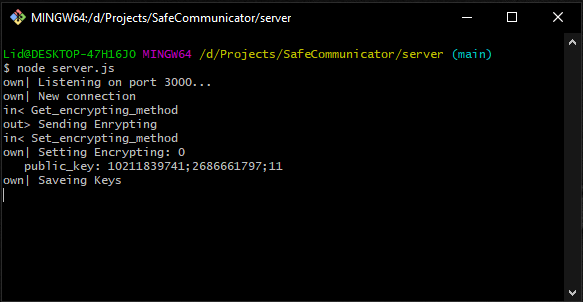
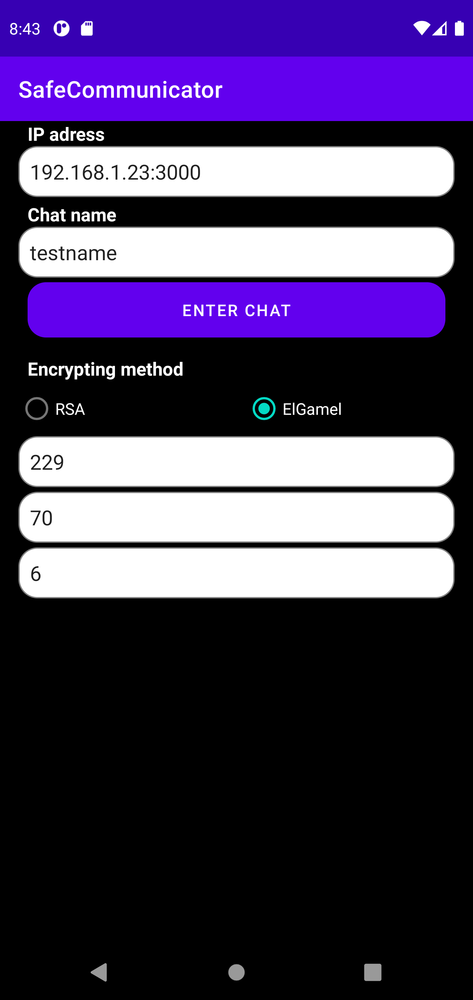
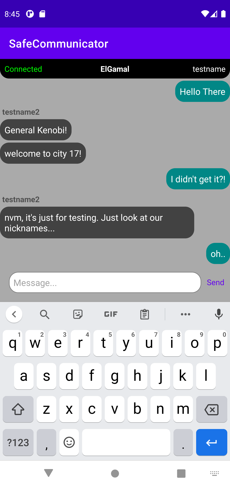
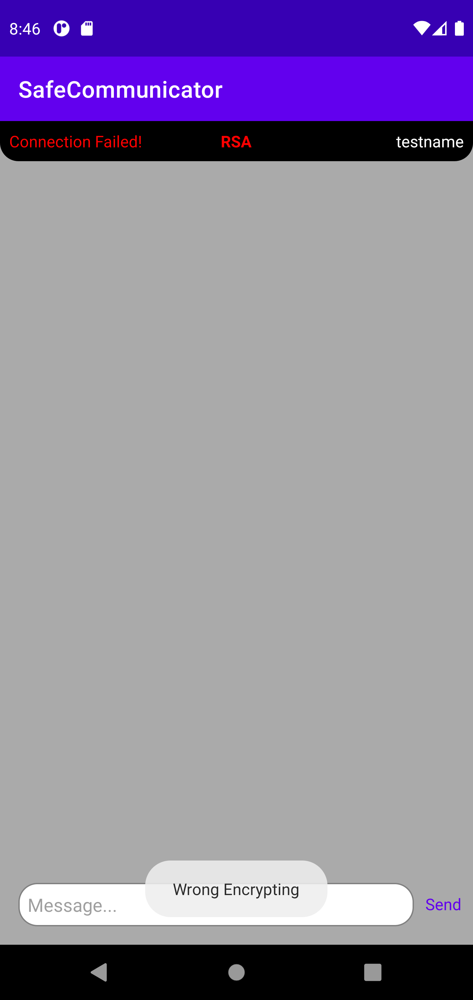
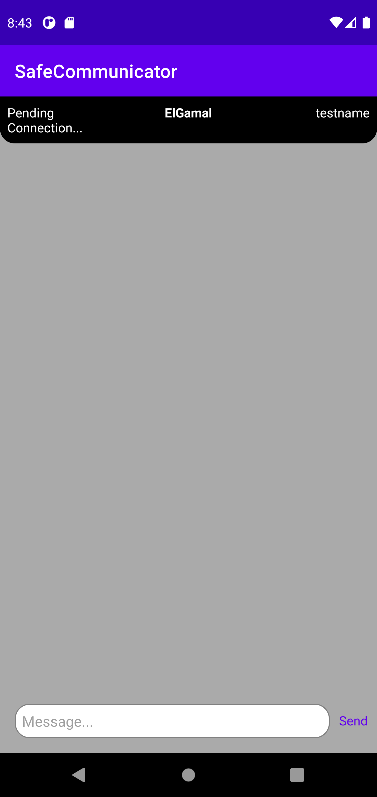

# Safe Communicator

It is a simple messeging application that provides the possibility to establish an encrypted connection between two Users. Application has client-server based charactersitics and requiers to run Node.js server on PC machine (any system). Application offer encrypting with two different encrypting methods: **RSA** or **ElGamal**.

## Server

To start server, simply open server folder location in console/terminal and type:
```
node server.js 
```
Server will be set up on port 3000 and listen for applications to connect. It will provide feedback of evenets occurring on the server.



## Android App

An Android application is also simple and intuitive. In main panel app allows User to set Server Ip Address, set Username for chat and choose encrypting method. This choice has an impact on which fields will be required to communicate between users. Application does not porvide generating private keys. The user is required to know the chosen encryption method and therefore set the appropriate private keys. First user wihch will successfully connect to the server determines it's enrypting method. If all users will quit the server, it's enrypting method will be wiped out.

<td></td>

#### RSA
RSA encrypting requires two prime factors to create public keys. Application requires same matching private keys for RSA communication to be set up for both users. 

#### ElGamal
Elgamal encrypting method works quite different. It needs three different factors:
* P -  sufficiently large Prime number p such that computation of the discrete logarithm is practically unfeasible.
* Alpha - an integer that meets the condition  `0 < Alpha < P - 1`
* G - Factor Number

Every user should have it's own factors for Elgamal encrypting. Client-Server communication exchenges public keys between users. While sending message, application enrypt it with other user public keys. Only user knowing private keys is able to decrypt message. Messages are sent to destination users in encrypted form. 

### Communication Status
If users set up correct values for private keys Connection should be set up. Application has 3 different states in main chat window.

* Connected - informs that connection was established and users are able to exchange messages.
* Pending Connection - informs that user connected successfully to the server, but there is no interlocutor conneted yet.
* Connection Failed - informs that something went wrong. Most common is that user tried connect to different encrypting method chat.

<table>
  <tr>
    <td>Chat</td>
     <td>Failed Connection</td>
     <td>Pending Connection</td>
  </tr>
  <tr>
    <td></td>
    <td></td>
    <td></td>
  </tr>
 </table>

## Requirements

Server requires [Node.js](https://nodejs.org/en/).

Android App was tested on Android version 7 and above!

## Download

Node.js Server: <a href="https://github.com/Liderty/SafeCommunicator/raw/main/binaries/SafeCommunicatorServer.zip" download>Server</a>

Android App:    <a id="raw-url" href="https://github.com/Liderty/SafeCommunicator/raw/main/binaries/SafeCommunicator.apk">Communicator</a>
